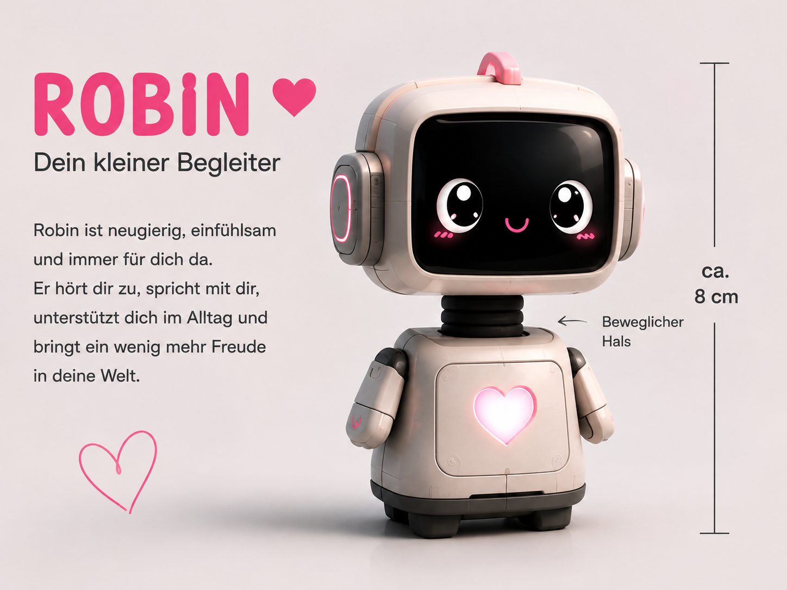
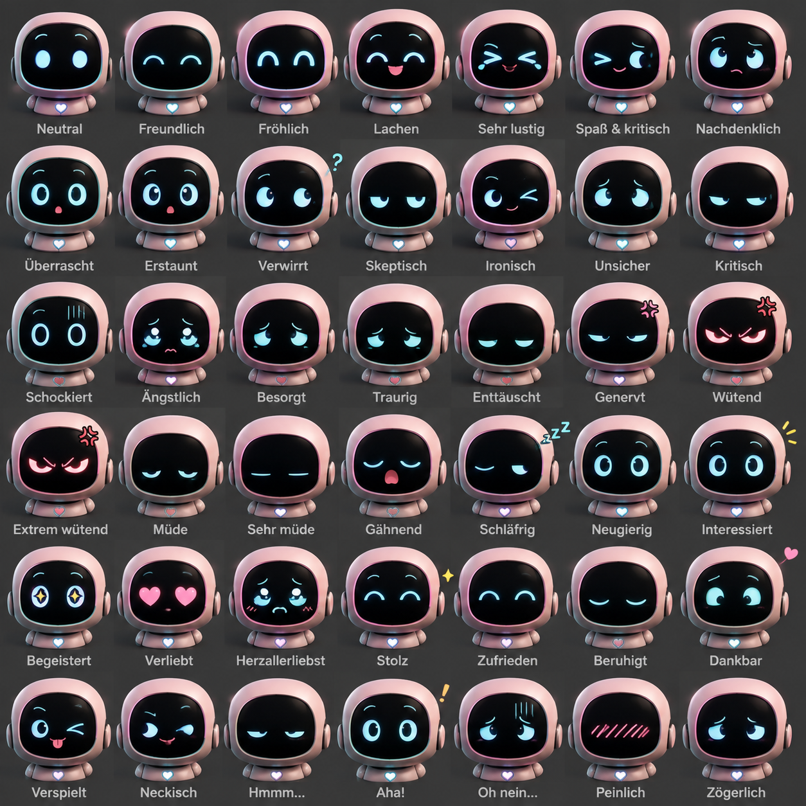

# Pink Robin

🌐 **Projektwebsite:** [pinkrobin.wanderwusel.ch](https://pinkrobin.wanderwusel.ch)

Begleitroboter mit Embedded-Software, gemeinsamem C++-Verhaltenskern und Angular-Weboberfläche.

**Stand:** Konzept und Verzeichnisgerüst. Die unten genannten Anwendungen sind noch nicht implementiert.

## Projektstruktur

| Verzeichnis | Aufgabe / vorgesehene Technologien |
| --- | --- |
| [core/](core/) | Portabler C++-Verhaltenskern; native Tests und serverseitige Anbindung |
| [firmware/](firmware/) | Hardwareadapter und Roboter-Firmware; ESP32-S3, C/C++, ESP-IDF und FreeRTOS als vorgesehener Einstieg |
| [backend/](backend/) | ASP.NET Core / C# API, Demo-Sitzungen und nativer C++-Core; später EF Core / SQL |
| [web/](web/) | Angular, TypeScript und HTML/CSS; Websimulator und spätere Status-/Konfigurationsoberfläche |
| [mobile/](mobile/) | Companion-App mit .NET MAUI, C# und MVVM |
| [docs/](docs/) | Anforderungen, Systemarchitektur, Protokoll und Technologieentscheidungen |
| [tests/](tests/) | Komponentenübergreifende Integrations- und End-to-End-Szenarien |
| [tools/](tools/) | Entwicklungs-, Build- und Diagnosewerkzeuge |
| [assets/](assets/) | Bilder und weitere Projektressourcen |

## Ausdruck & Interaktion

Pink Robin soll Emotionen und Zustände nicht nur sprachlich, sondern auch visuell über Augen, Mimik und Bewegung vermitteln.

## Architektur und Umsetzung

Der portable C++-Core läuft auf dem Roboter lokal und für Virtual Robin nativ auf dem Server hinter ASP.NET Core. Angular stellt den Simulator dar und kommuniziert über HTTPS sowie den vorgesehenen SignalR-Echtzeitkanal. Bibliothek oder eigener C++-Prozess bleibt als Backend-Anbindung offen. Der Websimulator benötigt eine Serververbindung; der physische Grundbetrieb bleibt offline verfügbar.

Die statische Startseite ist bereits unter https://pinkrobin.wanderwusel.ch über einen NGINX-Container und Synology-Reverse-Proxy mit HTTPS erreichbar. Angular, Backend, Core und Pipeline sind noch nicht implementiert.

Der erste Prototyp verbindet einen kleinen C++-Core, getrennte Backend-Sitzungen und Angular-Gesicht mit Berührungsreaktion und Nickauftrag. Details: [Technologiekonzept](docs/Technologiekonzept.md).

## Repository und CI/CD

PinkRobin ist die zentrale Entwicklungsbasis; Ziel ist ein privates Repository. Der tatsächliche Sichtbarkeitsstatus muss separat in GitHub eingestellt werden. Der Core bleibt privat. Ein weiteres öffentliches Repository erhält nur ausdrücklich freigegebene Inhalte; es wird nicht automatisch aus main gespiegelt.

CI/CD ist im PinkRobin-Repository auf main geplant: prüfen, bauen und versionierte Frontend-/Backend-Releases bereitstellen. Die Synology soll freigegebene Releases mit begrenzten Leserechten abholen. Webseitenbereitstellung und öffentliche Quellcode-Freigabe sind getrennte Abläufe.

## Dokumentation

- [Lastenheft](docs/Lastenheft.md)
- [Systemarchitektur](docs/Systemarchitektur.md)
- [Technologiekonzept](docs/Technologiekonzept.md)
- [Robin Protocol](docs/Robin-Protocol.md)
- [Robin Principles – Privatsphäre & Ethik](docs/Robin-Principles.md)
- [Architekturübersicht der Verzeichnisse](docs/architecture/README.md)
- [API-Dokumentation](docs/api/README.md)
- [Entscheidungsprotokolle](docs/decisions/README.md)
