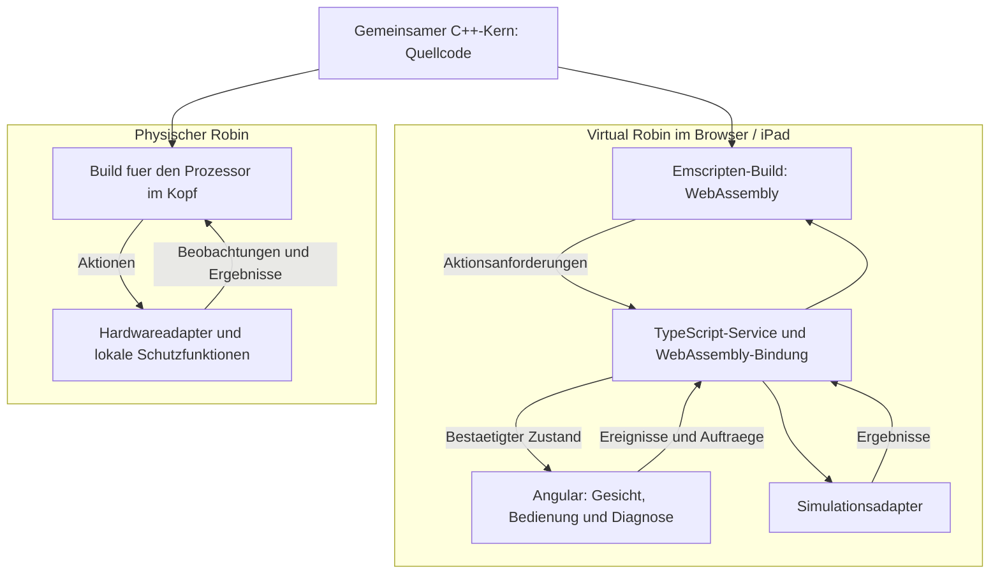
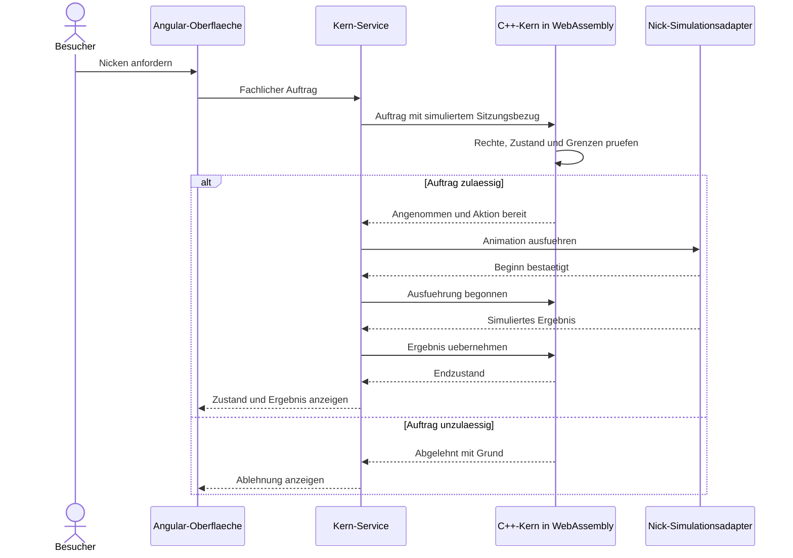
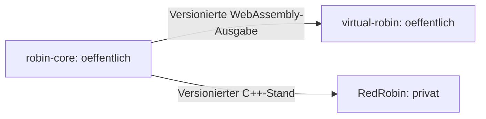

# Technologiekonzept: gemeinsamer Robin-Kern und Websimulator

Status: abgestimmte Technologierichtung mit noch offenen Umsetzungsdetails. Die beschriebenen Komponenten sind noch nicht implementiert.

## 1. Ziel und Einordnung

Robin erhält einen gemeinsamen Grundverhaltenskern in C++. Der Websimulator verwendet Angular mit TypeScript und lädt eine WebAssembly-Ausgabe dieses Kerns. Für den späteren Roboter wird derselbe portable C++-Quellcode mit einer passenden Hardwareanbindung gebaut.

Der Websimulator soll im Browser, auch auf dem iPad, nutzbar sein und als öffentliche Portfolio-Demo dienen. Die tatsächliche iPad-Kompatibilität wird mit dem ersten durchgängigen Prototyp geprüft.

Dieses Dokument ergänzt [Systemarchitektur](Systemarchitektur.md) und [Robin Protocol](Robin-Protocol.md). Das [Lastenheft](Lastenheft.md) bleibt technologieunabhängig. Die [Robin Principles](Robin-Principles.md) gelten auch für Simulation und öffentliche Demo.

## 2. Technologierichtung

| Bereich | Entscheidung | Verantwortung |
| --- | --- | --- |
| Gemeinsamer Grundverhaltenskern | C++ | Zustände, grundlegende Reaktionen, fachliche Auftragsprüfung und Aktionskoordination |
| Browser-Ausgabe des Kerns | WebAssembly über Emscripten | Portablen Kern im Browser ausführen |
| Websimulator | Angular und TypeScript, HTML/CSS | Gesicht, Bedienung, simulierte Sensoren und Diagnoseansicht |
| Browser-Anbindung | Kleine typisierte Schnittstelle mit Angular-Service | Initialisierung, Eingaben, Aktionen und Rückmeldungen verbinden |
| Simulationsadapter | TypeScript | Hardwareaktionen animieren und nachvollziehbare Ergebnisse liefern |
| Roboter-Anbindung | C++ mit separaten Hardwareadaptern | Anzeige, Sensoren, Motoren, Audio und lokale Schutzfunktionen |
| Erweitertes Smartphone-Verhalten | Noch offen | Erweiterte Wahrnehmung, Gespräche und langfristige persönliche Daten |

Emscripten unterstützt das Übersetzen nach WebAssembly und die Verbindung von C++ mit JavaScript. Angular-Komponenten bilden die Oberfläche; ein Service kapselt den Zugriff auf den geladenen Kern. Details zur Schnittstellenbindung werden beim ersten Prototyp ausgewählt.

## 3. Komponenten und gemeinsame Kernlogik

Die beiden Builds verwenden dieselbe fachliche Kernlogik, nicht dieselbe Binärdatei. Unterschiede der Umgebung liegen in Adaptern und dünnen Bindungen.

Der Kern greift nicht direkt auf Browseroberfläche, konkrete Motoren, Netzwerk oder ein bestimmtes Betriebssystem zu. Er empfängt Ereignisse und Aufträge und erzeugt Aktionen, Zustandsänderungen und Ergebnisse.

Der Simulator kann Smartphone-Verhalten als separaten Auftraggeber nachbilden. Dieses erweiterte Verhalten gehört nicht allein dadurch zum C++-Grundverhaltenskern, dass die Simulation auf einem iPad läuft.

## 4. Grenze zwischen Kern und Umgebung

| Richtung | Beispiel | Bedeutung |
| --- | --- | --- |
| Umgebung → Kern | Berührung erkannt | Fachliches Wahrnehmungsereignis |
| Umgebung → Kern | Nickauftrag eingegangen | Auftrag mit bereits zugeordneter Identität und Rechten |
| Umgebung → Kern | Zeit fortgeschritten | Kontrollierbare Zeitbasis fuer Fristen und Abläufe |
| Kern → Adapter | Begrenzte Nickbewegung ausführen | Freigegebene Aktion |
| Adapter → Kern | Begonnen, beendet oder fehlgeschlagen | Tatsächlicher Ausführungsstatus |
| Kern → Oberfläche | Neuer Zustand oder Erklärung | Darstellung des bestätigten Stands |

Die Umgebung übernimmt Transport und sichere Identitätsprüfung. Der Kern prüft die fachlich gewährten Rechte und Regeln; eine frei behauptete Identität aus einer Oberfläche ist keine Authentifizierung. Die öffentliche Demo arbeitet mit ausdrücklich simulierten Sitzungen und Rechten und behauptet keine implementierte Pairingsicherheit.

Zeit und gegebenenfalls Zufall werden kontrolliert eingespeist, damit Szenarien reproduzierbar sind. Der Kern arbeitet in kurzen, nicht blockierenden Verarbeitungsschritten. Eine Animation oder ein Browser-Timer darf nicht der einzige Nachweis für eine sichere physische Bewegung sein.

Speicher- und Rechenbedarf werden begrenzt und gemessen. Benötigter C++-Sprachstandard, Bibliotheksumfang und Speicherstrategie werden auf die spätere Zielhardware abgestimmt. Threads und besondere WebAssembly-Erweiterungen sind keine Voraussetzung fuer den ersten Umfang.

## 5. Ablauf eines simulierten Nickauftrags

Annahme, Beginn und Erfolg bleiben getrennt. Simulierte Ergebnisse sind gekennzeichnet und ersetzen keinen physischen Nachweis. Doppelte Aufträge, Abbruch und verlorene Rückmeldungen folgen dem Robin Protocol.

## 6. Angular-Websimulator und iPad

Die erste Darstellung ist eine interaktive 2D-Version. Angular-Komponenten übernehmen Gesicht, Stationsdarstellung, Bedienelemente und Diagnose. Ein zentraler Kern-Service kapselt Laden, Lebenszyklus und Aufrufe des WebAssembly-Moduls.

Da die WebAssembly-Initialisierung asynchron erfolgt, werden Bedienelemente erst nach erfolgreicher Initialisierung freigegeben. Ladefehler erhalten eine verständliche Anzeige. Eine zweite, unabhängige TypeScript-Implementierung des Grundverhaltens wird nicht als Ersatz eingeführt.

Die Oberfläche wird für Touch und unterschiedliche Bildschirmgrößen gestaltet. Die erste Demo benötigt weder Kamera noch Mikrofon; diese werden zunächst durch Ereignisse simuliert. Spätere echte Medienfunktionen benötigen bewusste Browserfreigaben und eigene Adapter.

Browser auf dem iPad dürfen nicht als dauerhaft laufende Robotersteuerung vorausgesetzt werden. Unterbrechung, Hintergrundbetrieb und erneuter Seitenaufruf werden praktisch geprüft. Bei Wiederaufnahme werden Zeit und Zustand abgeglichen; alte Aktionen dürfen nicht nachträglich unkontrolliert starten.

Web Worker, 3D-Darstellung und Offline-Installation können später ergänzt werden, wenn Bedarf und Geräteprüfung dies rechtfertigen.

## 7. Repository-Aufteilung

Die folgende Aufteilung ist die geplante Struktur. Dieses Dokument erstellt keine neuen Repositories und veröffentlicht keine bestehenden Inhalte.

| Vorgesehener Name | Sichtbarkeit | Inhalt |
| --- | --- | --- |
| robin-core | Öffentlich | Portabler C++-Kern, fachliche Schnittstellen, Tests und Browser-Bindung |
| virtual-robin | Öffentlich | Angular-Websimulator, Simulationsadapter und Portfolio-Darstellung |
| RedRobin | Privat | Hardwareintegration, interne Entwicklung und nicht zur Veröffentlichung freigegebene Unterlagen |

Beide Verbraucher beziehen einen festgelegten Kernstand. Sie kopieren die Kernlogik nicht in unabhängig weiterentwickelte Varianten. Kernversion und Protokollversion sind unterschiedliche Angaben; ihre Kompatibilität muss dokumentiert werden.

Die öffentliche Demo verwendet ausschliesslich synthetische Personen und Beispieldaten. Zugangsinformationen, private Gesprächsinhalte und interne Dateien gelangen nicht in veröffentlichte Browserdateien. Im Browser ausgelieferte Dateien sind für Besucher zugänglich, auch wenn ihre ursprüngliche Quelle privat war.

Vor tatsächlicher Aufteilung werden Lizenz, Veröffentlichungsumfang, Abhängigkeiten und Verteilung der Kernpakete festgelegt. Hosting und öffentliche Freischaltung werden als eigener Schritt behandelt.

## 8. Erster Umsetzungsumfang und Nachweis

Der erste Prototyp umfasst:

1. Kleinen C++-Kern mit Zustand, Berührungsreaktion und Nickauftrag.
2. Native Ausführung desselben Kerns für reproduzierbare fachliche Tests.
3. WebAssembly-Build mit schmaler TypeScript-Anbindung.
4. Angular-Gesicht, Touch-Eingabe, Nickanimation und Auftragsanzeige.
5. Szenarien für Ablehnung, doppelte Nachrichten, Abbruch und Verbindungsverlust.
6. Praktische Prüfung im iPad-Browser.

Erst danach folgen Stationslicht, Stationsdrehung und weitere Wahrnehmungs- beziehungsweise Datenfunktionen. Eine öffentliche Portfolio-Version erklärt sichtbar, welche Funktionen real implementiert und welche simuliert sind.

## 9. Offene Umsetzungsentscheidungen

Offen bleiben Zielprozessor, C++-Standard, konkrete Toolchain-Versionen, Bindungsverfahren, internes Speichermodell, Paketverteilung, Lizenz, Hosting sowie unterstützte iPad-/Browserstände.

Diese Details werden beim durchgängigen Prototyp festgelegt und überprüft. Die Kombination C++-Kern, WebAssembly und Angular ist die abgestimmte Technologierichtung.

## 10. Technische Referenzen

- [Emscripten: Building to WebAssembly](https://emscripten.org/docs/compiling/WebAssembly.html)
- [Emscripten: Connecting C++ and JavaScript](https://emscripten.org/docs/porting/connecting_cpp_and_javascript/index.html)
- [Angular: Components](https://angular.dev/guide/components)
- [Angular: Creating and using services](https://angular.dev/guide/di/creating-and-using-services)
