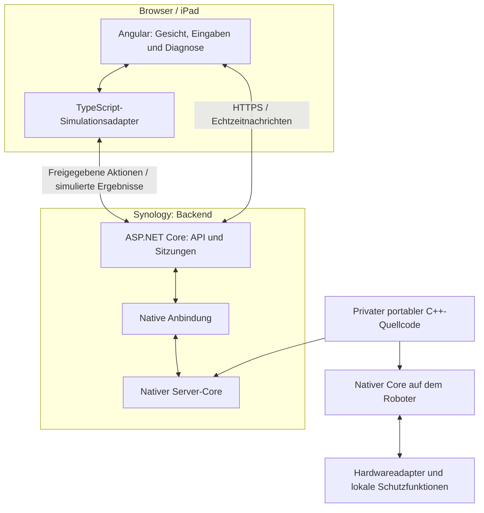
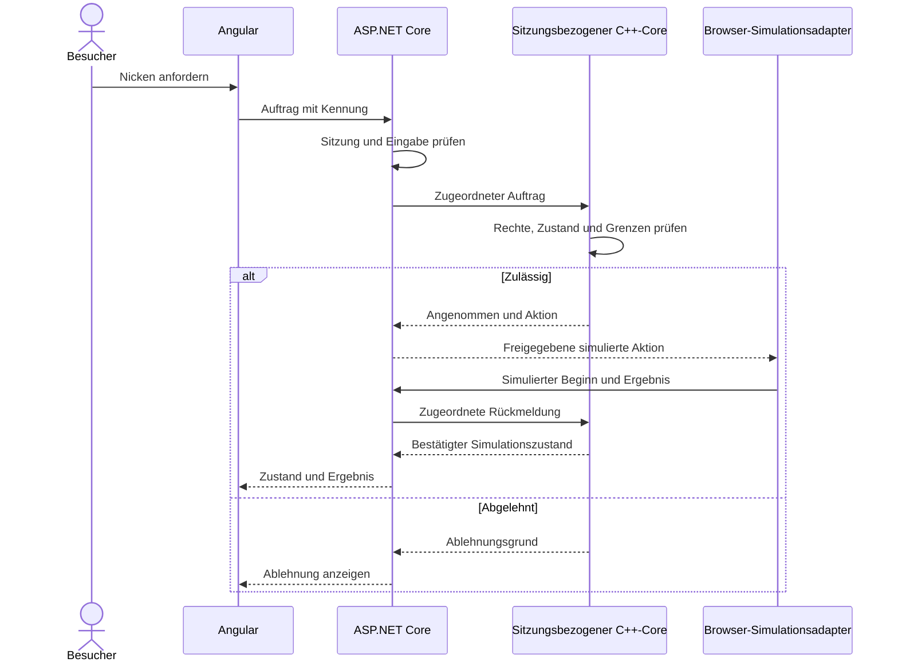

# Technologiekonzept: serverseitiger Robin-Kern und Websimulator

Status: abgestimmte Zielarchitektur. Der C++-Kern, Angular-Websimulator, ASP.NET-Core-Backend und CI/CD sind noch nicht implementiert. Die statische Startseite ist bereits über NGINX, Synology-Reverse-Proxy und HTTPS unter https://pinkrobin.wanderwusel.ch erreichbar.

## 1. Ziel und Einordnung

Robin erhält einen portablen Grundverhaltenskern in C++. Auf dem physischen Roboter läuft er lokal; Virtual Robin betreibt denselben fachlichen Quellcode nativ auf dem Server hinter ASP.NET Core. Angular stellt Gesicht, Bedienung, simulierte Wahrnehmung und Diagnose im Browser dar.

Diese Entscheidung ersetzt den bisherigen WebAssembly-/Emscripten-Ansatz für die öffentliche Webdemo. Weder C++-Quelldateien noch eine kompilierte Core-Binärdatei werden an Besucher ausgeliefert. Frontend-Dateien und über die API übermittelte Ergebnisse bleiben öffentlich zugänglich.

Die Serverabhängigkeit gilt für Virtual Robin, nicht für den physischen Roboter. Dessen Grundverhalten, Sicherheit und Energiemanagement bleiben offline verfügbar. Die Verantwortung der Companion-App für erweitertes Verhalten und persönliche Langzeitdaten bleibt erhalten.

Grundlagen: [Systemarchitektur](Systemarchitektur.md), [Robin Protocol](Robin-Protocol.md), [Lastenheft](Lastenheft.md) und [Robin Principles](Robin-Principles.md).

## 2. Technologierichtung

| Bereich | Entscheidung | Verantwortung |
| --- | --- | --- |
| Gemeinsamer Core | Portables C++ | Zustände, Reaktionen, fachliche Auftragsprüfung und Aktionskoordination |
| Webfrontend | Angular, TypeScript, HTML/CSS | Darstellung, Eingaben und simulierte Ausgaben |
| Backend | ASP.NET Core / C# | API, Sitzungsverwaltung, Validierung und serverseitige Core-Anbindung |
| Browserkommunikation | HTTPS-API; SignalR als vorgesehener Echtzeitkanal | Aufträge, Zustände und Rückmeldungen |
| Native Anbindung | C-ABI mit P/Invoke oder eigener C++-Prozess | Private serverseitige Core-Ausführung |
| Physischer Robin | Nativer C++-Build mit Hardwareadaptern | Lokales Verhalten und lokale Schutzfunktionen |
| Companion-App | .NET MAUI / C#, MVVM | Einrichtung, Verwaltung und erweitertes Verhalten |
| Persistenz | EF Core / SQL für spätere Backend-Daten | Erst bei tatsächlich benötigter dauerhafter Datenhaltung |
| Bereitstellung | Separate Frontend- und Backend-Container auf Synology DS1517+ | Statische Dateien und serverseitige Ausführung |
| CI/CD | GitHub Actions im Hauptrepository PinkRobin, Branch main | Prüfen, bauen und versionierte Releases bereitstellen |

Toolchain- und Runtime-Versionen werden bei der Umsetzung festgelegt. Linux-x64, Docker-Engine und gewähltes Runtime-Image müssen auf DSM 7.1.1 praktisch geprüft werden. Zusätzlicher RAM ersetzt keine Last- und Kompatibilitätsprüfung.

## 3. Komponenten und gemeinsame Kernlogik

Beide Builds verwenden dieselbe Kernlogik, nicht dieselbe Binärdatei. Der Core greift nicht direkt auf Netzwerk, Browser, Betriebssystem oder konkrete Hardware zu. Adapter liefern Ereignisse, Zeit und Ergebnisse.

Es entsteht keine unabhängige C#- oder TypeScript-Nachimplementierung des Grundverhaltens. Smartphone-Verhalten kann als eigener Auftraggeber simuliert werden.

## 4. Native Anbindung an ASP.NET Core

Der Betriebsort Server ist beschlossen; Bibliothek oder eigener Prozess bleibt eine Umsetzungsentscheidung.

| Variante | Umsetzung | Konsequenz |
| --- | --- | --- |
| Native Bibliothek | Linux-.so mit kleiner C-Schnittstelle, Aufruf aus C# über P/Invoke | Weniger Kommunikationsaufwand; native Abstürze können das Backend beenden |
| Eigener Prozess | Nativer C++-Dienst mit begrenztem internem Nachrichtenvertrag | Bessere Fehlertrennung; zusätzliche Prozess-, Transport- und Wiederanlaufverwaltung |

Für einen ersten Prototyp ist die Bibliotheksvariante ein möglicher Einstieg, keine bereits implementierte Entscheidung. Speicherbesitz, Lebensdauer, Fehlercodes, Datentypen und ABI-Version werden explizit definiert. C++-Exceptions überschreiten die C-Grenze nicht. Ein Prozessdienst wird nicht direkt öffentlich erreichbar gemacht.

Pro Demo-Sitzung existiert eine eigene Core-Instanz mit getrenntem Kontext und Auftragsbestand. Gleichzeitige Zugriffe auf eine Instanz werden geordnet; gemeinsam veränderlicher globaler Zustand ist zu vermeiden. Sitzungen, Eingaben, Rechenzeit, Speicher, Nachrichten und Warteschlangen werden begrenzt. Inaktive Sitzungen werden nach festgelegter Frist beendet und ihre temporären Daten verworfen.

## 5. Aufträge, Zeit und Rückmeldungen

Das Backend ordnet eine tatsächlich serverseitig verwaltete Demo-Sitzung zu und prüft Eingaben, Rechte, Version und Grenzen. Die öffentliche Demo verwendet synthetische Daten und simulierte Geräteberechtigungen; sie gewährt keine Rechte auf reale Roboter.

Zeit und gegebenenfalls Zufall werden kontrolliert eingespeist. Der Core prüft fachliche Rechte, Zustand und Grenzen. Der Server führt Simulationszeit und Auftragsfristen; ein Browser-Timer ist kein verlässlicher Abschlussnachweis.

Annahme, Beginn und Abschluss bleiben getrennt. Browserrückmeldungen sind untrusted Eingaben und werden auf Sitzung, Auftrag und zulässigen Ablauf geprüft. Simulierter Erfolg beweist keine physische Bewegung. Duplikate, Abbruch und verlorene Ergebnisse folgen dem Robin Protocol.

Bei Verbindungsverlust werden neue Eingaben gesperrt und laufende browserabhängige Aktionen nach einer definierten Frist abgebrochen oder als unbestätigt beendet. Wiederverbindung gleicht den tatsächlichen Serverstand ab; alte Aufträge werden nicht blind erneut gesendet. Serverneustart macht bisherige Sitzungen ungültig, sofern keine ausdrücklich implementierte Wiederherstellung existiert.

## 6. Angular-Websimulator und iPad

Die erste Darstellung ist eine interaktive 2D-Version. Angular zeigt Gesicht, Bedienung, Stationsdarstellung und Diagnose. Ein typisierter Service kapselt API und Echtzeitverbindung.

Bedienelemente werden erst nach erfolgreichem Sitzungs- und Zustandsabgleich freigegeben. Verbindungsaufbau, Backend-Ausfall, Wiederverbindung und Sitzungsablauf erhalten verständliche Anzeigen. Der Websimulator benötigt für Verhalten eine Serververbindung; eine gecachte Oberfläche ermöglicht keine Offline-Core-Ausführung.

Die erste Demo verwendet simulierte Sensorereignisse und benötigt weder Kamera noch Mikrofon. Oberfläche und Abläufe werden für Touch, iPad-Hintergrundbetrieb, Wiederaufnahme und erneuten Seitenaufruf geprüft. 3D und echte Medienfunktionen sind spätere Erweiterungen.

## 7. Repository und Veröffentlichung

PinkRobin ist die zentrale Entwicklungsbasis für Core, Firmware, Backend, Angular, Companion-App, Dokumentation und Pipeline. Ziel ist ein privates Repository. Die tatsächliche Sichtbarkeit muss in GitHub separat eingerichtet werden; dieses Dokument ändert keine Repository-Einstellungen.

Ein zusätzliches öffentliches Repository erhält ausschliesslich bewusst freigegebene Inhalte. Name und Freigabeprozess bleiben festzulegen. Es gibt keine automatische Spiegelung von main. Core-Quellcode bleibt privat; Companion-App und Backend werden ebenfalls nicht automatisch veröffentlicht. Die frühere Planung separater öffentlicher robin-core- und virtual-robin-Repositories ist ersetzt.

Webdeployment und Quellcode-Veröffentlichung sind getrennte Vorgänge. Die Pipeline veröffentlicht nur erforderliche Laufzeitdateien. C++-Quellen, native Core-Binärdateien, private Dokumentation, Schlüssel und interne Debug-Artefakte gelangen nicht ins Frontend. Auch Build-Logs, Container-Registry und Release-Artefakte benötigen passende Zugriffsrechte.

## 8. Docker, Domain und Synology

Bereits eingerichtet: NGINX-Container pinkrobin-web, NAS-Port 8080 auf Container-Port 80, Reverse Proxy und HTTPS für pinkrobin.wanderwusel.ch. Die vorhandene HTML-Startseite ist noch kein Angular-Simulator.

Geplant:
- Frontend-Container mit fertig gebautem Angular und statischem NGINX.
- Backend-Container mit ASP.NET-Runtime und nativer Core-Bibliothek; bei Prozessvariante ein getrennt verwalteter interner Core-Dienst.
- Synology-Reverse-Proxy als TLS-Einstieg; / führt zum Frontend. /api und der vorgesehene SignalR-Pfad /hubs werden zum Backend geroutet, etwa über einen vorgeschalteten NGINX innerhalb des Deployment-Netzes. Die konkrete Pfadweiterleitung muss implementiert und geprüft werden; die bisherige Hostregel allein richtet sie nicht ein.

Mehrstufige Builds trennen Compiler und Laufzeit. Angular wird auf CI gebaut. C++ und Backend werden für zusammenpassende Linux-ABI, Architektur und Bibliotheken gebaut; nur benötigte Runtime-Dateien kommen ins Backend-Image. Der Browser erhält keine .wasm-Ausgabe des Cores.

NGINX unterstützt Angular-Routen, ohne fehlende Assets oder API-Aufrufe als HTML zu beantworten. Versionierte Ressourcen können gecacht werden; Einstiegseite und Releasewechsel müssen neue Versionen zuverlässig laden. Frontend, Backend, Core und Protokollversion werden gemeinsam dokumentiert.

Bei SignalR muss die gesamte Proxy-Kette den gewählten Transport, insbesondere WebSocket-Upgrades und passende Zeitgrenzen, unterstützen. Backend-Port und interner Core-Dienst erhalten keine direkte öffentliche Routerfreigabe.

## 9. CI/CD auf main

Die Pipeline liegt im zentralen PinkRobin-Repository:
1. Änderungen prüfen; native Core-Tests, Backend-Integration und Angular-Build ausführen.
2. Versionsgebundene Frontend-/Backend-Artefakte aus demselben Commit erstellen.
3. Geprüftes Deployment-Release mit kompatiblen Versionen und Prüfsummen in einer zugriffsgeschützten Ablage bereitstellen.
4. Synology holt freigegebene Releases über einen begrenzten Lesezugang ab. Speicherort, Abrufintervall und Authentifizierung werden noch festgelegt.
5. Neues Release vorbereiten, Gesundheits- und durchgängige Sitzungs-/Auftragstests durchführen und kontrolliert aktivieren.
6. Vorherigen funktionsfähigen Stand für Rollback behalten; fehlgeschlagenes Release nicht dauerhaft aktivieren.

CI/CD ist geplant, noch nicht eingerichtet. Quellcode-Freigaben ins öffentliche Repository gehören nicht in den automatischen main-Deployment-Ablauf. Zugangsinformationen werden über geschützte CI- und NAS-Konfiguration bereitgestellt, nicht committed oder in Images eingebaut.

Ein dauerhaft allgemeine GitHub-Aufträge ausführender NAS-Runner ist keine Voraussetzung für diesen Abrufweg. Container-Registry, Image-Versionen, Rollback-Verfahren und spätere Datenbankmigrationen müssen konkretisiert werden.

## 10. Erster Umsetzungsumfang und Nachweis

1. Portabler C++-Core mit Zustand, Berührungsreaktion und Nickauftrag sowie nativen Tests.
2. ASP.NET-Core-Anbindung und begrenzte, getrennte Demo-Sitzungen.
3. API für Ereignis, Auftrag, Status und simuliertes Ergebnis; konkrete DTOs und Transportverträge dokumentieren.
4. Angular-Gesicht, Touch-Eingabe, Nickanimation und bestätigte Zustandsanzeige.
5. Duplikate, Ablehnung, Abbruch, fehlende Rückmeldung, Verbindungsverlust und Serverneustart prüfen.
6. Zwei gleichzeitige Sitzungen ohne gegenseitige Beeinflussung nachweisen.
7. Linux-Container auf DS1517+ und Browser/iPad durchgängig prüfen.
8. CI/CD, Proxy-Routing und Rollback erproben.

Die Portfolio-Demo kennzeichnet implementierte und simulierte Funktionen. Physische Sicherheit und Hardwarequalität werden separat geprüft.

## 11. Offene Entscheidungen

Native Bibliothek oder eigener Prozess; C++-Standard und Toolchains; unterstützte .NET-/Angular-Versionen; ABI oder internes Prozessprotokoll; API-/SignalR-Vertrag; konkrete Sitzungs- und Ressourcenlimits; Linux-Container-Kompatibilität; Releaseablage und NAS-Abruf; öffentliches Repository und Freigaben; unterstützte Browser; spätere Persistenz.

Die Plattformwahl für Virtual Robin ist beschlossen: Angular im Browser, ASP.NET Core und nativer C++-Core auf dem Server. Die lokale Firmware bleibt unabhängig.

## 12. Technische Referenzen

- [Microsoft: Native interoperability](https://learn.microsoft.com/dotnet/standard/native-interop)
- [Microsoft: P/Invoke](https://learn.microsoft.com/en-us/dotnet/standard/native-interop/pinvoke)
- [Microsoft: ASP.NET Core SignalR](https://learn.microsoft.com/en-us/aspnet/core/signalr/introduction)
- [Angular: Deployment](https://angular.dev/tools/cli/deployment)
- [Docker: Multi-stage builds](https://docs.docker.com/build/building/multi-stage/)
